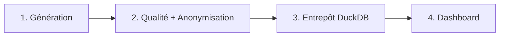

# Playbook — Enterprise Data Quality & Pipeline Automation Platform

> Guide opératoire structuré en 4 volets (Définitions / Process / Documentation / Templates),
> pour comprendre, réutiliser ou transposer cette plateforme à un contexte réel.
> Rappel : projet personnel (POC), données 100% simulées, aucun assureur/mutuelle réel — voir [`README.md`](README.md).

---

## 1. Définitions

**Vocabulaire du domaine**

| Terme | Définition |
|---|---|
| **Data Health Score** | 3 scores distincts (Complétude, Exactitude, Fraîcheur), pondérés par criticité — pas un score global unique |
| **Règle déclarative** | Une règle de qualité décrite en YAML (champ, type de contrôle, catégorie, criticité), pas codée en dur en Python |
| **Pseudonymisation** | Remplacer une donnée identifiante par un identifiant dérivé (hash), non réversible sans le sel utilisé |
| **Fact / Dimension** | `fact_claims` : un événement par ligne (sinistre) ; `dim_societaires` : un sociétaire par ligne, attributs descriptifs |

**Modèle de données** — champs, types, statut PII et traitement RGPD détaillés dans [`config/data_dictionary.yaml`](config/data_dictionary.yaml).

---

## 2. Process

1. **Génération** (`src/generator.py`) — sociétaires et sinistres simulés, anomalies injectées de façon contrôlée et reproductible (seed fixe), réparties en familles cycliques plutôt qu'au hasard.
2. **Qualité + Anonymisation** (`src/quality_engine.py`, `src/anonymizer.py`) — les règles sont lues depuis `config/rules.yaml` via un registre de fonctions nommées ; seules les lignes validées passent à l'anonymisation.
3. **Entrepôt** (`src/pipeline.py`, `sql/`) — staging (typage) → marts (`dim_societaires`, `fact_claims`), exécuté par DuckDB, persisté dans un fichier `.duckdb` réutilisable.
4. **Dashboard** (`dashboards/app.py`) — rejoue tout le pipeline en mémoire (`@st.cache_data`), affiche le scorecard, le détail des écarts et le dictionnaire de données.

**Point de décision réutilisable** : ne jamais filtrer silencieusement une ligne en écart dans un mart — l'exposer avec une colonne booléenne (`societaire_existe`, `sinistre_avant_adhesion`, `remboursement_incoherent`) et ne filtrer qu'au moment du calcul d'un KPI ou d'un export métier. Ça garde le mart utile pour l'audit ET pour l'usage courant.

---

## 3. Documentation

- [`README.md`](README.md) — contexte métier, architecture, stack, avancement par étape
- [`config/data_dictionary.yaml`](config/data_dictionary.yaml) — dictionnaire de données, classification RGPD par champ
- [`config/rules.yaml`](config/rules.yaml) — toutes les règles de qualité, en clair, modifiables sans toucher au code
- [`PROMPT_LOG.md`](PROMPT_LOG.md) — méthode de construction avec l'IA, y compris le bug de tranche d'âge trouvé après coup et le manque de grain pour `fact_claims` signalé avant de construire à côté

---

## 4. Templates réutilisables

- **`src/quality_engine.py`** — moteur de règles générique piloté par YAML (`REGISTRE_REGLES`) : ajouter une règle = ajouter une entrée dans `config/rules.yaml`, éventuellement une nouvelle fonction si le type de contrôle n'existe pas encore. Transposable à n'importe quel jeu de données tabulaire.
- **`src/anonymizer.py`** — pattern de pseudonymisation par hash dérivé d'un identifiant stable (jamais de la donnée sensible elle-même) + masquage partiel format-preserving pour téléphone/IBAN. Transposable à tout champ PII structuré.
- **`src/pipeline.py`** — exécuteur SQL générique inspiré dbt (charge des DataFrames dans DuckDB, exécute une liste ordonnée de modèles `.sql`, trace le statut de chacun) — même moteur que le projet Unified Customer Analytics du portfolio.

**Règle de transposition** : pour appliquer ce playbook à un cas réel (base sociétaires, CRM assurance), remplacer `generator.py` par une extraction réelle et adapter `config/rules.yaml`/`config/data_dictionary.yaml` aux règles métier et à la classification RGPD propres au contexte — le moteur de qualité, l'anonymiseur et le pipeline restent inchangés.

---

*Gisèle Metouck — Consultante Data Steward & Gouvernance · [GitHub](https://github.com/Kingdmfncr)*
