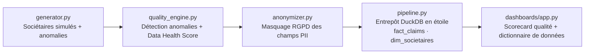

# Enterprise Data Quality & Pipeline Automation Platform

⚠️ **Projet personnel (POC)** — démonstration de méthode. Données de sociétaires et contrats entièrement simulées, aucune personne réelle, aucun assureur/mutuelle réel, aucune infrastructure cloud propriétaire connectée (BigQuery, Databricks, etc.).

Je voulais comprendre comment un poste hybride Business Analyst Engineer / Data Quality Manager gère concrètement, de bout en bout, la fiabilisation d'une base de sociétaires dans le secteur assurance/mutuelle : détection d'anomalies, conformité RGPD sur les données personnelles, modélisation en entrepôt, et pilotage via un score de santé lisible par un comité de direction — alors j'ai construit ce projet, étape par étape.

## Ce que ça résout

Une base de sociétaires alimentée par plusieurs canaux (souscription en ligne, agence, reprise d'un ancien système) accumule des problèmes qui ne sautent pas aux yeux tant que personne ne les cherche activement : doublons de numéro de sociétaire, emails invalides qui font échouer les campagnes de communication obligatoires, incohérences de date de naissance, et données personnelles sensibles (nom, téléphone, IBAN) manipulées sans masquage. Ce projet montre comment :
- générer et caractériser un jeu de données réaliste avec anomalies contrôlées, pour donner quelque chose de concret au moteur de qualité,
- détecter ces anomalies selon des règles déclaratives plutôt que du code ad hoc dispersé,
- anonymiser les champs personnels sensibles avant tout usage en aval, conformément au principe de minimisation RGPD,
- modéliser la donnée validée dans un entrepôt en étoile (faits/dimensions) exploitable pour du reporting,
- rendre la qualité de la base pilotable via un score de santé et un dictionnaire de données consultable.

## Architecture cible



## Avancement

Projet construit pas à pas, étape validée avant de passer à la suivante.

- ✅ **Étape 1 — Génération de données** (`src/generator.py`) : 1000 sociétaires simulés, 4 familles d'anomalies injectées de façon contrôlée et reproductible (seed fixe) — emails invalides, dates de naissance incohérentes, doublons de numéro de sociétaire, téléphones mal saisis. Champs PII (nom, téléphone, IBAN) volontairement laissés en clair à ce stade : c'est le rôle de l'étape 2.
- ✅ **Étape 2 — Moteur de qualité & anonymisation** (`src/quality_engine.py`, `src/anonymizer.py`) : 10 règles déclarées dans `config/rules.yaml` (aucune règle codée en dur), Data Health Score à 3 axes (Complétude 100 / Exactitude 98,3 / Fraîcheur 98,7 sur le dernier jeu généré), export du rapport détaillé et des lignes valides. `anonymizer.py` pseudonymise le nom (hash stable dérivé du numéro de sociétaire, jamais du nom lui-même), masque téléphone et IBAN, et n'anonymise que les lignes déjà validées par le moteur de qualité — jamais une ligne dont l'intégrité n'est pas garantie.
- ✅ **Étape 3 — Pipeline & entrepôt** (`src/pipeline.py`, `sql/`) : pipeline SQL en couches (staging → marts) exécuté via DuckDB, sans dbt ni entrepôt cloud à connecter. `generator.py` a été complété avec une table `sinistres` (600 lignes, 4 familles d'anomalies orientées règles métier : référence orpheline, remboursement supérieur au montant déclaré, sinistre antérieur à l'adhésion, montant négatif) — nécessaire pour donner un vrai grain à `fact_claims`. Le mart garde tous les sinistres visibles pour l'audit, avec 3 colonnes booléennes d'écart plutôt qu'un filtrage silencieux : sur le dernier lot généré, 59 sinistres référencent un sociétaire absent du référentiel validé (dont 12 volontairement orphelins, le reste provenant de sociétaires eux-mêmes rejetés par le moteur de qualité), 11 sont antérieurs à l'adhésion, 24 ont un remboursement incohérent.
- ✅ **Étape 4 — Dashboard** (`dashboards/app.py`) : Data Health Scorecard, détail des anomalies (règles sociétaires + écarts `fact_claims`), preuve visuelle du masquage RGPD (avant/après sur nom/téléphone/IBAN), exploration `dim_societaires`/`fact_claims`, et dictionnaire de données interactif filtrable par champ PII.
- ✅ **Tests** (`tests/test_quality.py`) : 17 tests Pytest — règles de qualité unitaires, reproductibilité du générateur (seed fixe), pseudonymisation/masquage RGPD, et intégrité référentielle de `fact_claims` (référence orpheline, remboursement incohérent, sinistre avant adhésion) sur des cas construits à la main plutôt que sur le jeu généré aléatoire.

Dictionnaire de données complet, avec classification RGPD par champ : voir [`config/data_dictionary.yaml`](config/data_dictionary.yaml).

## Stack

Python · Pandas · DuckDB (entrepôt SQL embarqué) · Pydantic / règles déclaratives type Great Expectations · Streamlit · Pytest.

## Lancer en local

```bash
pip install -r requirements.txt

# En ligne de commande, étape par étape :
python src/generator.py          # génère data/raw/societaires_bruts.csv et data/raw/sinistres_bruts.csv
python src/quality_engine.py     # calcule le Data Health Score, écrit data/processed/quality_report.csv
python src/anonymizer.py         # anonymise les lignes valides, écrit data/processed/societaires_anonymises.csv
python src/pipeline.py           # construit l'entrepôt DuckDB (dim_societaires, fact_claims) -> data/processed/entrepot.duckdb

# Ou directement le dashboard (regénère et rejoue tout le pipeline en mémoire) :
streamlit run dashboards/app.py

# Tests
pytest tests/ -v
```

## Pour une mission réelle

Cette architecture se transpose à un environnement réel (base sociétaires, CRM assurance, ou tout référentiel client sensible) : livraison d'un premier moteur de qualité + scorecard en 5 à 7 jours ouvrés, adapté à vos règles métier et vos contraintes RGPD. Contact via [Sovereign Career](https://www.sovereigncareer.fr/freelance/freelance-consultant-data-steward-gisele-metouck).

---

Playbook complet (Définitions/Process/Documentation/Templates) : [`PLAYBOOK.md`](PLAYBOOK.md).
Construit avec l'IA — méthode documentée dans [`PROMPT_LOG.md`](PROMPT_LOG.md).
**Gisèle Metouck** — Consultante Data Steward & Gouvernance · [GitHub](https://github.com/Kingdmfncr)
